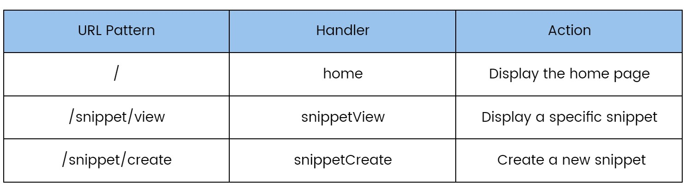
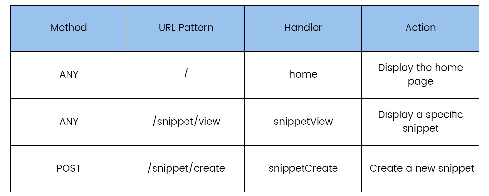

## Routing Requests
<!--  -->



## Fixed path and subtree patterns

Go’s servemux supports two different types of URL patterns: fixed paths and subtree paths.

Fixed paths don’t end with a trailing slash, whereas subtree paths do end with a trailing slash.

1. Fixed Paths:
    - "/snippet/view" and "/snippet/create" — are both examples of fixed paths.

    - In Go’s servemux, fixed path patterns like these are only matched (and the
corresponding handler called) when the request URL path exactly matches the fixed path.

2. Subtree Paths:
    - In contrast, pattern "/" is an example of a subtree path (because it ends in a trailing
slash).

    - Another example would be something like "/static/"

    - Subtree path patterns are
matched (and the corresponding handler called) whenever the start of a request URL path
matches the subtree path.

    - This helps explain why the "/" pattern is acting like a catch-all. The pattern essentially means
match a single slash, followed by anything (or nothing at all).


**So what if you don’t want the "/" pattern to act like a catch-all?**

For instance, in the application we’re building we want the home page to be displayed if —
and only if — the request URL path exactly matches "/". Otherwise, we want the user to
receive a 404 page not found response.

It’s not possible to change the behavior of Go’s servemux to do this, but you can include a
simple check in the home hander which ultimately has the same effect.


## The DefaultServeMux

The http.Handle()
and http.HandleFunc() functions allow us to register routes without declaring a
servemux, like below:

```
func main() {
    http.HandleFunc("/", home)
    http.HandleFunc("/snippet/view", snippetView)
    http.HandleFunc("/snippet/create", snippetCreate)
    log.Print("Starting server on :4000")
    err := http.ListenAndServe(":4000", nil)
    log.Fatal(err)
}
```


Behind the scenes, these functions register their routes with something called the
DefaultServeMux. There’s nothing special about this — it’s just regular servemux like we’ve
already been using, but which is initialized by default and stored in a net/http global
variable. Here’s the relevant line from the Go source code:

```
var DefaultServeMux = NewServeMux()
```

Although this approach can make our code slightly shorter, But is not recommended for
production applications.

Because ```DefaultServeMux``` is a global variable, any package can access it and register a route
— including any third-party packages that our application imports. If one of those third party packages is compromised, they could use ```DefaultServeMux``` to expose a malicious
handler to the web.


## Servemux features

- In Go’s servemux, longer URL patterns always take precedence over shorter ones. So, if a
servemux contains multiple patterns which match a request, it will always dispatch the
request to the handler corresponding to the longest pattern. This has the nice side-effect
that you can register patterns in any order and it won’t change how the servemux behaves.

- Request URL paths are automatically sanitized. If the request path contains any . or ..
elements or repeated slashes, the user will automatically be redirected to an equivalent
clean URL. For example, if a user makes a request to ```/foo/bar/..//baz``` they will
automatically be sent a ```301 Permanent Redirect``` to ```/foo/baz``` instead.

- If a subtree path has been registered and a request is received for that subtree path
without a trailing slash, then the user will automatically be sent a 301 Permanent Redirect
to the subtree path with the slash added. For example, if you have registered the subtree
path /foo/, then any request to /foo will be redirected to /foo/.


**Host name matching**

When it comes to pattern matching, any host-specific patterns will be checked first and if
there is a match the request will be dispatched to the corresponding handler. Only when
there isn’t a host-specific match found will the non-host specific patterns also be checked.
```
mux := http.NewServeMux()
// Host-specific pattern
mux.HandleFunc("example.com/hello", helloHandler)

// Non-host-specific pattern
mux.HandleFunc("/hello", defaultHelloHandler)
```

## Customizing HTTP headers

Let’s now update our application so that the ```/snippet/create``` route only responds to HTTP
requests which use the POST method:



Our ```snippetCreate``` handler function will send a 405 (method
not allowed) HTTP status code unless the request method is ```POST```.

```
func snippetCreate(w http.ResponseWriter, r * http.Request){
	
	if r.Method != "POST"{
		w.WriteHeader(405)
		w.Write([]byte("Method Not Allowed"))
		return
	}
	 
	w.Write([]byte("Create a new snippet.."))
}
```
- It’s only possible to call w.WriteHeader() once per response, and after the status code has
been written it can’t be changed. If you try to call w.WriteHeader() a second time Go will
log a warning message.

- **If you don’t call w.WriteHeader() explicitly, then the first call to w.Write() will
automatically send a 200 OK status code to the user. So, if you want to send a non-200
status code, you must call w.WriteHeader() before any call to w.Write().**

Start the server and try:

```
Invoke-WebRequest -Uri http://localhost:4000/snippet/create -Method Post
```
or
```
curl -i -X POST http://localhost:4000/snippet/create
```

You'd get:

```
StatusCode        : 200                                                                                                              
StatusDescription : OK                                                                                                               
Content           : Create a new snippet..
RawContent        : HTTP/1.1 200 OK
                    Content-Length: 22
                    Content-Type: text/plain; charset=utf-8
                    Date: Sat, 23 Dec 2023 13:12:47 GMT

                    Create a new snippet..
Forms             : {}
Headers           : {[Content-Length, 22], [Content-Type, text/plain; charset=utf-8], [Date, Sat, 23 Dec 2023 13:12:47 GMT]}
Images            : {}
InputFields       : {}
Links             : {}
ParsedHtml        : mshtml.HTMLDocumentClass
RawContentLength  : 22

```

> Important: Changing the response header map after a call to ```w.WriteHeader()``` or
```w.Write()``` will have no effect on the headers that the user receives. You need to make
sure that your response header map contains all the headers you want before you call
these methods.


we can make is to use [constants](https://pkg.go.dev/net/http#pkg-constants) from the net/http package for HTTP
methods and status codes, instead of writing the strings and integers ourselves.

we can use the constant ```http.MethodPost``` instead of the string ```"POST"```, and the
constant http.StatusMethodNotAllowed instead of the integer ```405```.

```
func snippetCreate(w http.ResponseWriter, r * http.Request){

	if r.Method != "POST"{
		// w.Header().Set("Allow", "POST")
		w.Header().Set("Allow", http.MethodPost)
		
		// http.Error(w, "Method No Allowed", 405)
		http.Error(w, "Method Not Allowed", http.StatusMethodNotAllowed)
		return
	}
}
```