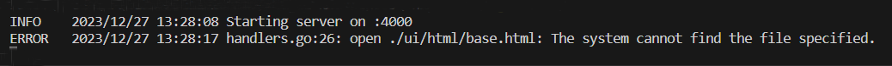

# Dependency Injection

`Dependency Injection:` A design pattern where dependencies (like services or components) are provided to a function or object instead of being created within it. This promotes loose coupling and testability.


There’s one more problem with our logging that we need to address. If we open up our
`handlers.go` file you’ll notice that the `home` handler function is still writing error messages
using Go’s standard logger, not the `errorLog` logger that we want to be using.

```
func home(w http.ResponseWriter, r *http.Request) {
    ...
    ts, err := template.ParseFiles(files...)

    if err != nil {
        log.Print(err.Error()) // This isn't using our new error logger.
        http.Error(w, "Internal Server Error", 500)
        return
    }

    err = ts.ExecuteTemplate(w, "base", nil)

    if err != nil {
        log.Print(err.Error()) // This isn't using our new error logger.
        http.Error(w, "Internal Server Error", 500)
    }
}
```

**How can we make our new `errorLog` logger available to our home
function from `main()`?**

Most web applications will have multiple dependencies
that their handlers need to access, such as a database connection pool, centralized error
handlers, and template caches.

**So, how can we make any
dependency available to our handlers?**

There are a few different ways to do this:

1. The simplest being is to just put the dependencies in
global variables.

2. But in general, it is good practice to inject dependencies into your handlers.
    - It makes your code more explicit, less error-prone and easier to unit test than if you use global
variables.

    - For applications where all your handlers are in the same package, like ours, a neat way to
inject dependencies is to put them into a custom application struct, and then define your
handler functions as methods against application.

 ```
// Define an application struct to hold the application-wide dependencies for the

// web application. For now we'll only include fields for the two custom loggers, but

// we'll add more to it as the build progresses.

type application struct {
    errorLog *log.Logger
    infoLog *log.Logger
}
```

-----------------
**`app.errorLog.Print(err.Error())`  vs  `app.errorLog.Print(err)`**

- `app.errorLog.Print(err.Error())` logs the string representation of the error obtained by calling `err.Error()`

- The `Error()` method of the error interface returns a string representing the error message.

- This is useful when you want to log the error message explicitly as a string.

- `app.errorLog.Print(err)` logs the error value directly, without converting it to a string
```
err := &CustomError{Code: 42, Message: "Something went wrong"}

app.errorLog.Print(err) // logs the entire CustomError value
```


## Adding a deliberate error

Change `home.tmpl` to `home.bak`.<br>
Run the program.<br>
You will get the following:


You can see the `ERROR` prefix before the log message.


## Closures for dependency injection

The pattern that we’re using to inject dependencies won’t work if your handlers are spread
across multiple packages. In that case, an alternative approach is to create a `config` package
exporting an `Application` struct and have our handler functions close over this to form a
_closure_. like:
```
func main() {
    app := &config.Application{
        ErrorLog: log.New(os.Stderr, "ERROR\t", log.Ldate|log.Ltime|log.Lshortfile)
    }
    mux.Handle("/", examplePackage.ExampleHandler(app))
}

func ExampleHandler(app *config.Application) http.HandlerFunc {
    return func(w http.ResponseWriter, r *http.Request) {
        ...
        ts, err := template.ParseFiles(files...)
        if err != nil {
            app.ErrorLog.Print(err.Error())
            http.Error(w, "Internal Server Error", 500)
            return
        }
    }
    ...
}
```


## Centralized error handling

Let’s neaten up our application by moving some of the error handling code into helper
methods. This will help separate our concerns and stop us repeating code as we progress
through the build.


We'll  add a new helpers.go file under the cmd/web directory
```
package main

import(
	"fmt"
	"net/http"
	"runtime/debug"
)


func(app * application) serverError(w http.ResponseWriter, err error){
	trace := fmt.Sprintf("%s\n%s", err.Error(), debug.Stack())
	// app.errorLog.Print(trace)
	app.errorLog.Output(2, trace)

	http.Error(w, http.StatusText(http.StatusInternalServerError), http.StatusInternalServerError)
}

func (app *application) clientError(w http.ResponseWriter, status int){
	http.Error(w, http.StatusText(status), status)
}


func(app *application) notFound(w http.ResponseWriter){
	app.clientError(w, http.StatusNotFound)
}
```

- In the `serverError()` helper we use the `debug.Stack()` function to get a stack trace for the
current goroutine and append it to the log message. Being able to see the execution path
of the application via the stack trace can be helpful when you’re trying to debug errors.

- In the `clientError()` helper we use the `http.StatusText()` function to automatically
generate a human-friendly text representation of a given HTTP status code. For example,
`http.StatusText(400)` will return the string "Bad Request".


Adding a deliberate error:

change `home.tmpl` to `home.abc` <br>
Run the program now. <br>
You'll see,
```
ERROR   2023/12/27 15:15:22 helpers.go:14: open ./ui/html/pages/home.pk: The system cannot find the file specified.
```

`helpers.go: line 14` is where the error is getting printed. <br>
But It would be better, if we know, where the call originated that led to error. means: origin --> `helpers.go [serverError()]` --> `helpers.go:line 14[app.errorLog.Print(trace)]` <br>

- So, if we go two step back in the stack trace, we will find where did the error originate.

we add the following line in the serverError():
```
app.errorLog.Output(2, trace)
```

The number `2` in `Output(2, trace)` represents the call depth, indicating how many levels up in the call stack the logging function should look to determine the source of the log message. In this context:

- `0` would refer to the Output function itself. -`app.errorLog.Output(2, trace)` in `serverError()` itself

- `1` would refer to the function that called Output.
        - `serverError()` 

- `2` refers to the function that called the function that called Output, and so on. - `app.serverError(w, err)` in `handlers.go` : line 29